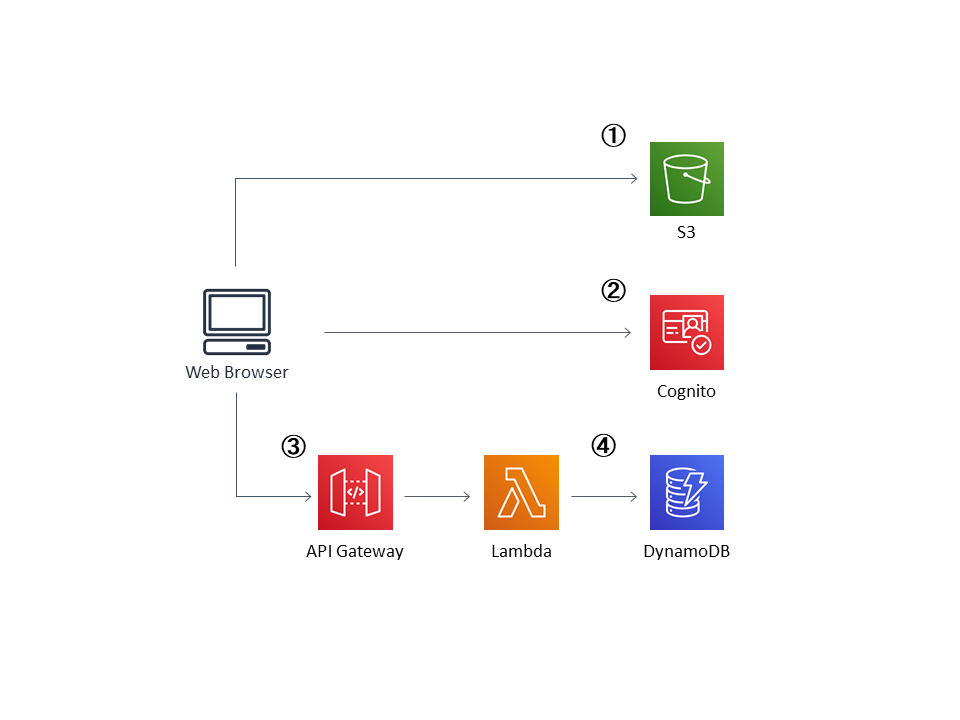

# AWS Serverless Tutorial - WildRides
Codes for [AWS Serverless Tutorial](https://aws.amazon.com/getting-started/projects/build-serverless-web-app-lambda-apigateway-s3-dynamodb-cognito/) - maknig a website "WildRides".

 

# Architecture
